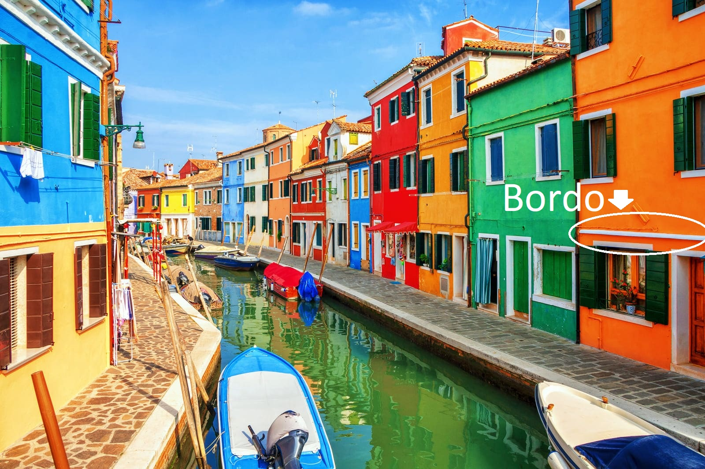
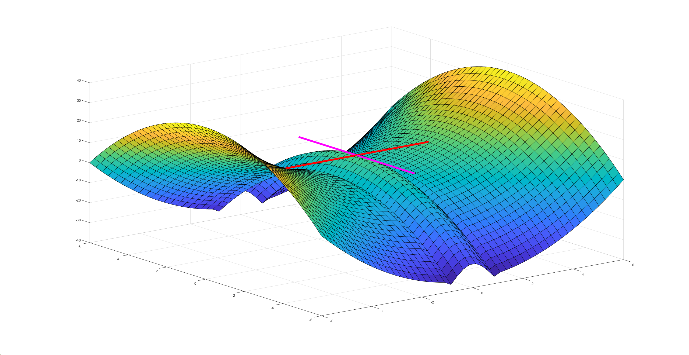
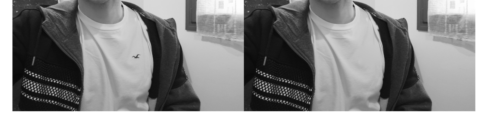
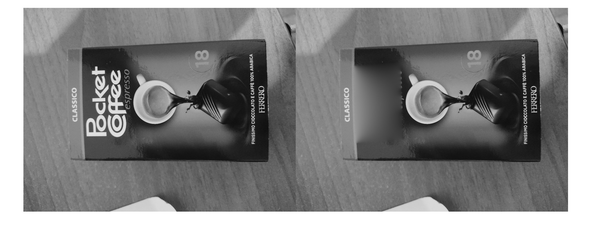
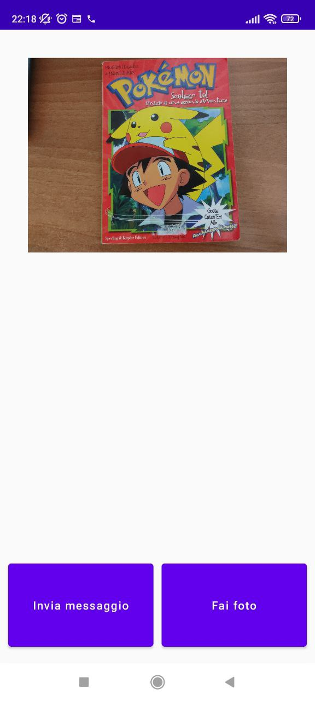

# Logo Removal con SIFT 
## Struttura del progetto
- funzione MATLAB `SIFT_frame_funzione` che rimuove un logo da una foto passata come parametro
- server MATLAB che riceve una immagine via socket TCP e la censura rimuovendo il logo se presente
- app android in Kotlin che invia via socket TCP una immagine al server MATLAB dall'archivio del telefono
- funzioni e script per la Demo all'esame
### Funzioni demo per la presentazione:
- `videoCensor` è una funzione che prende come input il percorso di un video e quello di un logo e censura da tutti i frame del video il logo se è presente. Questa funzione è un buon benchmark per verificare l'effetto del cambio di parametri nel SIFT (contando quanti frame vengono correttamente censurati si può determinare quali sono i parametri ottimali)
- `testDifferenceOfGaussian.m` è una demo che mostra i passaggi effetuati dal SIFT nella creazione del DOG e approsimazione del Laplaciano. Viene spiegata la teoria dietro questa demo nel prossimo paragrafo "Cos'è SIFT?"
- `mainSIFT` è una demo che mostra l'implementazione di SIFT di Matlab ne viene spiegato il funzionamento nel paragrafo "SIFT in Matlab"
---
## Cos'è SIFT? (Scale Invariant Feature Transform)
SIFT è un algoritmo di estrazione di feature da un'immagine che prende in input un'immagine e restituisce un sottoinsieme di punti rappresentativi dell'immagine (keyPoints) con delle corrispondenti descrizioni dei punti che possono essere utilizzate per trovare corrispodenze tra immagini diverse, SIFT è invariante a cambiamenti di scala e in gran parte anche a rotazioni.

_In questa parte è possibile utilizare la demo `testDifferenceOfGaussian.m` per vedere i passaggi effetuati da SIFT nel creare la DOG_
### Scale Space (invarianza spaziale e eliminazione rumore)
SIFT prima di tutto costruisce lo scale space: crea N versioni scalate dell'immagine originale (in modo da ottenere scale-invariance SI) da ognuna di queste N versioni crea altre M immagini con livelli diversi di gaussian-blur. Alla fine della procedura avremo NxM immagini. Ogni livello di scalatura viene chiamato ottava e contiene M versioni con blur diversi

### Difference of Gaussian (DOG)
Poi SIFT ottiene un nuovo set di immagini per ogni ottava sottranedo dalle immagini con poco blur (varianza della gaussiana bassa) quelle con molto blur mantenedo quindi le componenti ad alta frequenza e attenuando quelle a bassa frequenza.

Su questo set chiamato DOG difference of gaussians per ogni immagine si trovano gli estremi locali. Per farlo si compara ogni pixel con gli 8 che lo circondano nella immagine e con i 9 corrispondenti nell'ottava precedente e i 9 corrispondenti nell'ottava successiva se il pixel è > di questi altri 26 (o < di tutti) allora viene preso come feature.

#### Approsimazione del Laplaciano
La DOG approssima l'operatore Laplaciano con la differenza che non deve essere normalizzato per la scala (Laplaciano è scale variant perché le immagini a risoluzione più alta hanno pendenze più basse ovvero valori delle derivate più bassi)
[[1]Feature Detection with Automatic Scale Selection -Tony Lindeberg](https://www.google.com/url?sa=t&rct=j&q=&esrc=s&source=web&cd=&cad=rja&uact=8&ved=2ahUKEwimn5HDnKL9AhXdVPEDHWv8DBUQgAMoAHoECAQQAw&url=https%3A%2F%2Fscholar.google.it%2Fscholar_url%3Furl%3Dhttps%3A%2F%2Fwww.diva-portal.org%2Fsmash%2Fget%2Fdiva2%3A453064%2FFULLTEXT01.pdf%26hl%3Dit%26sa%3DX%26ei%3DeWvyY53MAYnRmQG5rZjoBQ%26scisig%3DAAGBfm2D1tnXnxPIQhLCQ1lZ67xJ3atmlw%26oi%3Dscholarr&usg=AOvVaw2Un3fIr2ZUJbkX0xfO4-kr).

### Rimozione feature a contrasto basso o lungo bordi
Con la procedura precedente otteniamo troppi feature points: dobbiamo eliminare le feature spurie date da punti a basso contrasto o bordi che non sono dei veri estremi locali.
Prima di tutto si rimuovono i punti in aree a basso contrasto: si computa la differenza tra il pixel del keypoint e quelli adiacenti, se questa è sotto un certo threshold il keypoint viene scartato.

Rimozione dei keypoint dovuti esclusivamente a bordi: lungo la direzione parallela ai bordi di un oggetto i valori dei pixel cambiano poco mentre nelle altre direzioni cambiano molto. 

Questo genera dei keyPoint molto sensibili al rumore,quindi eventuale rumore può trasformare punti di sella in estremi locali. 

Per individuare questi falsi estremi si utilizzano gli autovalori della matrice Hessiana, se il loro rapporto è maggiore di una certa soglia i punti vengono scartati.

(questo perché il rapporto degli autovalori è proporzionale alla differenza tra la curvatura lungo x e quella lungo y).
|  |
| :--: |
|Bordo che può causare falsi estremi locali|

|  |
| :--: |
|Punto di sella trasformato in estremo locale da rumore|

_Per l'estrazione delle descrizioni delle feature e il matching si guardi la prossima sezione SIFT in Matlab_
## SIFT in Matlab
ATTENZIONE: Eseguire il file `mainSIFT.m` per vedere il codice collegato a questa spiegazione.
### Estrazione keyPoints
In MATLAB per ottenere l'insieme dei punti rappresentativi si usa la funzione `detectSIFTFeatures(Immagine)` che trova gli estremi locali e rimuove gli estremi spuri (punti di sella e punti a basso contrasto). Le figure 1 e 2 di `mainSIFT.m` mostrano i punti estratti dal logo e dalla foto.
### Estrazione feature 
Dai punti ottenuti nel passaggio precedente `extractFeatures(Immagine,Punti)` estrae le feature in tre passaggi
1. Stima l'orientazione dei keyPoint per avere invarianza alle rotazioni: per ogni keyPoint calcola modulo e orientazione del gradiente in una regione attorno al keyPoint, poi crea un istogramma con asse orrizontale che va da 0 a 360 con n bin e per ogni gradiente calcolato aggiunge il modulo del gradiente al bin corrispondente all'orientazione. Il bin con modulo massimo verrà considerato l'orientazione del keyPoint nel punto 2.
2. Si consideri una regione quadrata (di solito 16x16) attorno al keyPoint, la si divide in m per m quadrati (di solito 4x4) e per ogni quadrato si ripete il calcolo del gradiente tramite il metodo dell'istogramma del punto 1 (con 8 bin di solito). L'insieme delle direzioni dei gradienti in questi quadrati verrà preso come vettore di feature del keyPoint.
3. Per poter avere invarianza alle rotazioni dell'immagine agli elementi del vettore di feature del punto 2 si sottrae l'orientazione del keyPoint trovata nel punto 1

_Se si usano i valori standard per i parametri ogni vettore di feature ha 128 elementi  (MATLAB utilizza una implementazione di extractFeatures con i parametri standard)_
### Matching delle feature
Dopo aver estratto le feature sia dal logo che dalla foto dobbiamo collegare i potenziali keyPoint corrispondenti.

Le feature per ogni keyPoint sono dei vettori in R<sup>128</sup> quindi è possibile utilizzare la distanza euclidea per determinare per ogni keyPoint della foto a quale keyPoint del logo è più vicino in termini di feature. La funzione corrispondente in Matlab è `matchFeatures(featureLogo,featureFoto)`.

Un parametro importantissimo in questa funzione è `MatchThreshold`: se la distanza tra le feature è > di `MatchThreshold`il match viene scartato, ciò permette di gestire la quantità di falsi positivi/falsi negativi.

Sperimentalmente ho trovato che per ottenere il minor numero di falsi negativi il miglior valore di questo parametro è 10 o 11. Questo matching si vede nella figure 3 di `mainSIFT.m`.

Infine si rimuovono i match outlier: si stima il tipo di trasformazione avvenuto al logo, scegliendo tra lineare, affine o omografia tramite `estgeotform2d(matchLogo,matchFoto,tipoTrasformazione)`.

I match che non rispettano la trasformazione determinata vengono scartati e rimangono solo i match inlier figure 4 su Matlab.

### ROI e censura del logo
Per poter cancellare il logo determiniamo una zona della foto che verrà censurata. 

Nel punto precedente abbiamo determinato la trasformazione che porta dal logo alla foto quindi prendiamo come controimmagini i 4 vertici del logo e applicando la trasformazione a questi 4 punti otterremo i vertici di un poligono nella foto (l'immagine attraverso la trasformazione dei 4 punti nel dominio).
Questo si può fare su Matlab con `transformPointsForward(trasformazione,poligonoLogo)`,dal poligono ottenuto possiamo ricavare una region of interest sulla figura con `drawpolygon` e trasformarla in una maschera con `createMask(roi)` poi applicheremo un filtro interpolatore sulla foto con questa maschera con `regionfill(immagine,mask)` che andrà a censurare il logo nella foto. Il filtro interpolatore tende a funzionare meglio in zone di colore uniforme e senza riflessi (esempio logo hollister) ma in ogni caso riesce a nascondere il logo.
|  |
| :--: |
|Il logo viene eliminato senza lasciare segni sulla maglia|


|  |
| :--: |
|Il logo viene eliminato ma si nota la censura a causa dei riflessi della scatola|

_La funzione `SIFT_frame_funzione` esegue tutti i passaggi di `mainSIFT.m` senza mostrare le figure in modo da poterla usare nella demo della `censuraVideo` e nel server._

## App android e Server Matlab
### Client Android
L'app android è scritta in Kotlin e utilizza il toolkit `Jetpack Compose` per il rendering della UI e funzioni asincrone e socket per l'invio delle immagini via TCP.

|  |
| :--: |
|Layout dell'applicazione|

L'applicazione è composta da una preview della foto da inviare, un pulsante per mandare l'immagine al server e un pulsante che apre un filepicker della galleria per scegliere la foto.

Dopo aver scelto la foto dal filepicker l'app android ottiene l'URI corrispondente alla foto e legge il file in un oggetto `Bitmap foto` tramite `BitmapFactory.decodeStream()` quando `foto` viene cambiata JetPack Compose osserva come lo stato `mutableState` della variabile sia cambiato e quindi forza un recompose della UI disegnando a schermo la immagine appena letta.

Quando viene premuto il pulsante "Invia messaggio" faccio partire una coroutine asincrona che gestirà il socket TCP per l'invio della foto questa coroutine è assegnata ai thread riservati all'IO (tramite `Dispatcher.IO`) così non bloccherà la normale esecuzione dell'app.

Per inviare la foto comprimo la `Bitmap foto` in formato PNG tramite `foto.compress(Bitmap.CompressFormat.PNG, 100, stream)` .

Kotlin è completamente interoperabile con Java e quindi per l'invio del file ho usato i Socket da `java.net.Socket`

Per l'invio dell'immagine ho scelto un protocollo molto semplice: invio tutta la foto in un unico `write` seguita da 32 byte di `NULL` (32 byte a 0) come ending sequence per avvisare il server che la trasmissione dell'immagine è terminata e può procedere con la censura.

Il motivo per cui ho scelto questa ending sequence è che viene ignorata direttamente quando scrivo il file PNG in quanto è composta da `NULL`.

### Server MATLAB

Il server di Matlab ascolta sulla porta 4316 TCP e una volta che il client si connette comincia a ricevere i byte e a concatenarli nel vettore `dataread` in modo da poter ricomporre l'immagine. 

Il vettore `dataread` è di tipo `uint8` corrispondente al tipo `byte` di Kotlin e Java.

Dopo ogni chunk di byte letti il server controlla se il chunk termina con 32 byte di zeri tramite la funzione `checkFineStream`, quando arriva questa ending sequence smette di leggere byte e comincia l'elaborazione dell'immagine.

Da Matlab posso utilizzare degli oggetti Java per scrivere l'immagine ricevuta su un file `outputFile.png`:
```
outputFile=javaObject("java.io.File","outputFile.png");
outputStream=javaObject("java.io.FileOutputStream",outputFile);
javaMethod("write",outputStream,dataread)
javaMethod("close",outputStream)
```
Dopo aver salvato l'immagine posso procedere con l'elaborazione tramite SIFT come spiegato nel paragrafo precedente per ottenere l'immagine censurata che viene scritta in `censurataOutput.png`.

---
Link e reference utili usati durante il progetto:

* [[2]Introduction to SIFT( Scale Invariant Feature Transform)](https://medium.com/data-breach/introduction-to-sift-scale-invariant-feature-transform-65d7f3a72d40).
* [[3]Computer vision Toolbox Mathworks](https://www.mathworks.com/products/computer-vision.html)
* [[4]Android Studio Documentation](https://developer.android.com/docs)
